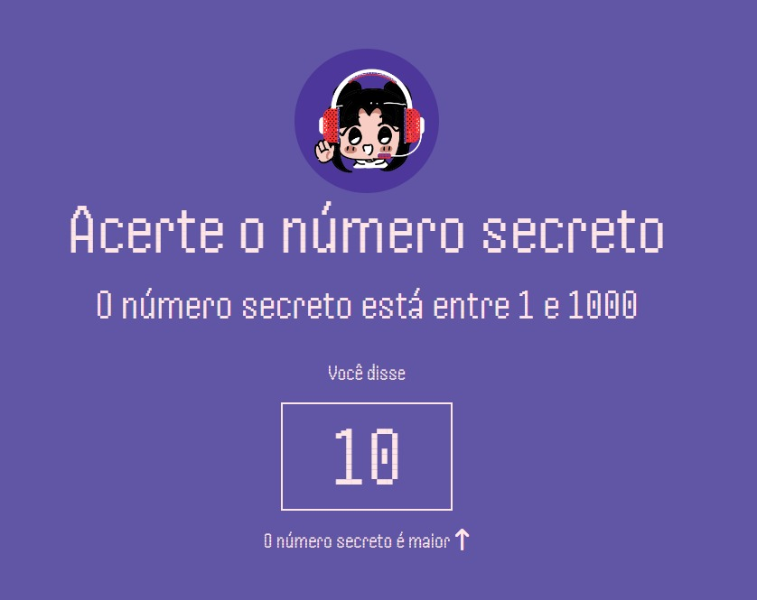
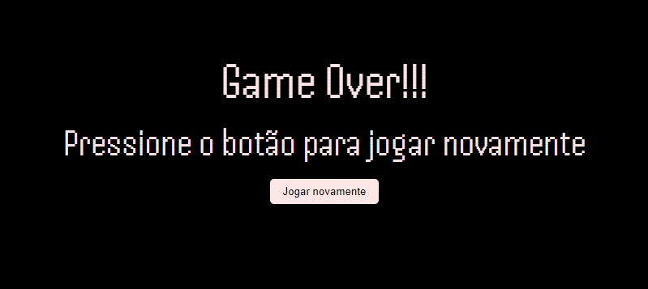
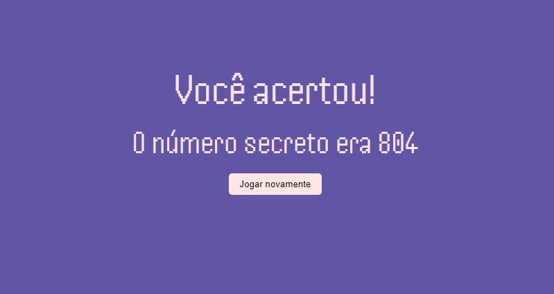
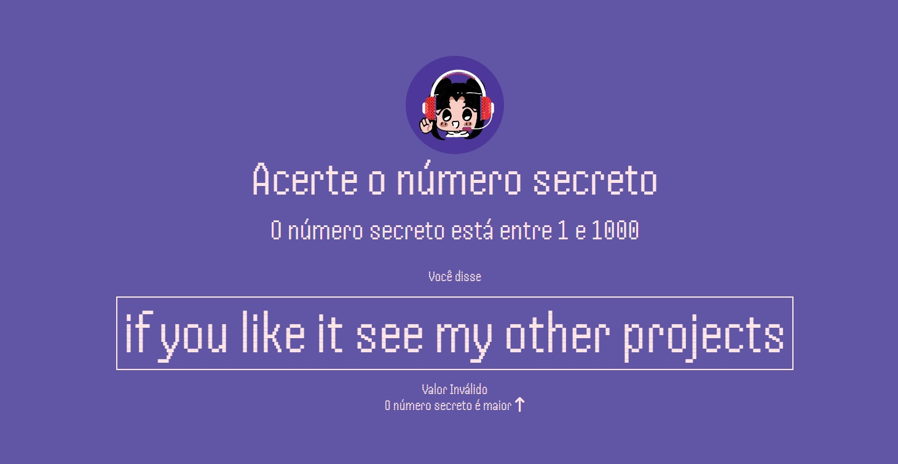

## Projeto: Número Secreto | Project: Secret Number

### Desenvolvido no curso; JavaScript: validações e reconhecimento de voz

### Developed in the course; JavaScript: validations and speech recognition

#### Funcionamento esperado;

- O jogo sorteia um numero pseudoaleatório utilizando a função Math.random()
- Quem estiver jogando faz um palpite, falando em voz alta
- O palpite deve ser identificado pelo computador que dirá se esta certo ou não
- No caso de palpite errado é mostrado na tela o número falado sinalizando se o palpite é maior ou menor que o número correto

- Ao dizer GAME OVER o jogo deve ser encerrado e a tela deve mostrar a opção de jogar novamente

- Ao acertar o número deve aparecer uma tela de acerto com a opção de jogar novamente.

#### Expected operation, in English..

- The game generates a pseudorandom number using the Math.random() function
- Whoever is playing makes a guess, speaking out loud
- The guess must be identified by the computer that will say if it is right or not
- In the case of a wrong guess, the spoken number is shown on the screen, indicating whether the guess is greater or less than the correct number
- When saying GAME OVER the game must be closed and the screen must show the option to play again
- When you hit the number, a hit screen should appear with the option to play again.

### Conteúdo | Content

- Using the Web Speech API
- JavaScript build-in functions
- Voice recognition with JavaScript
- Manipulation of data, events and elements with JavaScript

